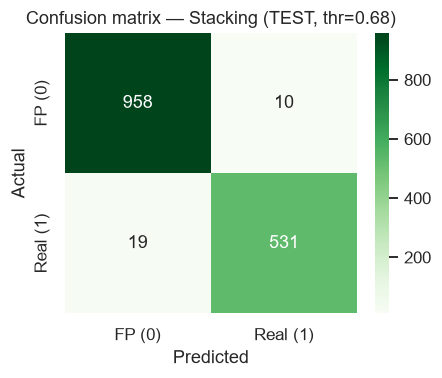
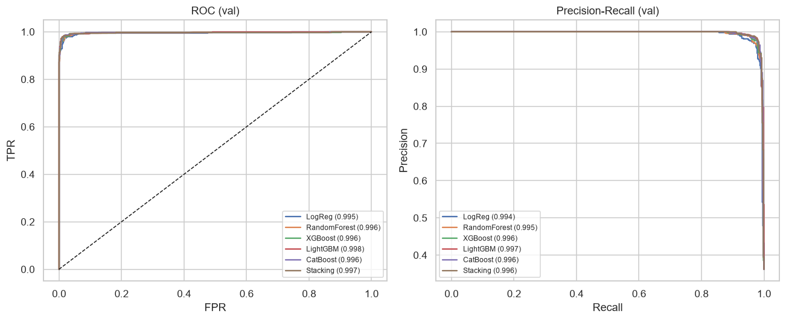
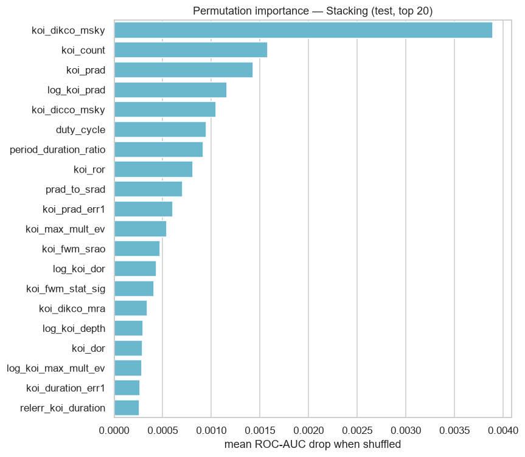
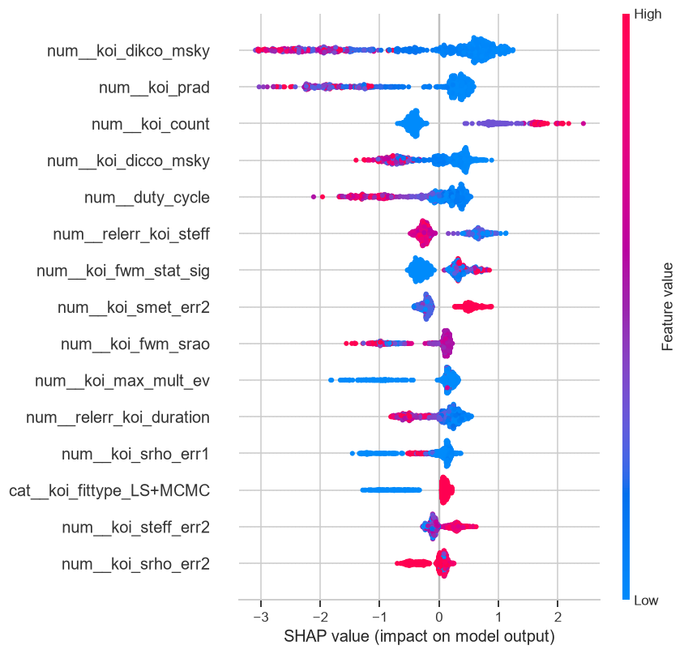
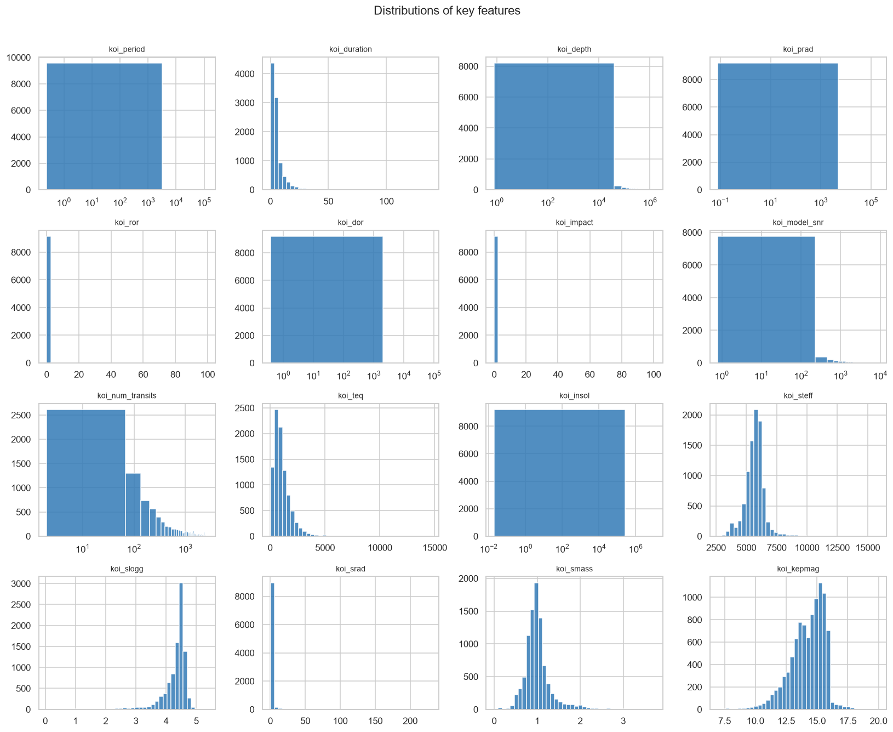

# 🪐 ExoSense AI — Finding Real Exoplanets in Starlight

> A reproducible, leakage-free machine-learning pipeline that separates **real exoplanets** from **false positives & noise**, built on real **NASA Exoplanet Archive** data (Kepler Objects of Interest).
>
> Submission to the **India High School Exoplanet Data Challenge** (Celesta).

<p align="left">
  
  
  
  
  
  
</p>

<p align="left">
  <a href="https://nbviewer.org/github/Asnanp/exosense-ai/blob/main/exoplanet_classification.ipynb"></a>
  <a href="https://colab.research.google.com/github/Asnanp/exosense-ai/blob/main/exoplanet_classification.ipynb"></a>
</p>

---

## 🔭 The problem

Astronomers don't *see* distant planets — they watch a star's brightness and look for the faint, repeating **dip** that happens when a planet passes in front of it (a *transit*). But most dips are imposters: eclipsing binary stars, instrument noise, or light from a nearby contaminating star. **ExoSense AI** learns to tell the real planets from the fakes using only the *physical measurements* of each detection — never the human verdict.

## 🏆 Headline results

The best model is a **stacking ensemble** (XGBoost + LightGBM + CatBoost + Random Forest → logistic meta-learner).

| Framing | Best model | Test **F1** | Test ROC-AUC | Test Accuracy | Cross-val F1 |
|---|---|:--:|:--:|:--:|:--:|
| **Headline** — CONFIRMED vs FALSE POSITIVE | Stacking | **0.973** | **0.996** | **0.981** | **0.972 ± 0.002** |
| Inclusive — CONFIRMED + CANDIDATE vs FALSE POSITIVE | Stacking | 0.901 | 0.970 | 0.903 | 0.903 ± 0.003 |

> The tiny cross-validation standard deviation (±0.002) shows the score is **genuine generalisation, not a lucky split**. Strong scores are *earned* — every column that leaks the NASA verdict is removed before training (see below).

**Why two framings?** The `CANDIDATE` class is genuinely *undecided* (those objects simply haven't been confirmed or rejected yet), which caps any model that must classify them. We report the **headline** model the way professional vetting pipelines (e.g. NASA's Robovetter) are trained — on the *decided* cases — and also the honest **inclusive** model that matches the mission wording exactly.

<p align="center">
  
  
</p>

## 🚫 No data leakage (the most important step)

The KOI table is full of columns that *are the answer in disguise*. Using them would score ~100% and learn nothing transferable. **All of these are removed up front:**

| Dropped | Why it leaks |
|---|---|
| `koi_disposition` | the label itself |
| `koi_pdisposition` | the pipeline's own CANDIDATE / FALSE-POSITIVE verdict |
| `koi_fpflag_nt/ss/co/ec` | the four false-positive flags = the *reasons* for an FP call |
| `koi_comment`, `koi_vet_stat/date`, `koi_disp_prov` | human vetting notes & provenance |
| `kepler_name` | only assigned to confirmed planets → presence reveals the label |
| `koi_score` | disposition confidence score |

Plus pure identifiers (`rowid`, `kepid`, `kepoi_name`, data-product URLs).

## 🧪 What the model learned (explainability)

Permutation importance and SHAP agree — and they're reassuring: the model leans on exactly the quantities astronomers use by hand.

<p align="center">
  
  
</p>

- **Centroid offsets** (`koi_dikco_msky`, `koi_dicco_msky`) — if the dimming comes from an *offset* star, it's a false positive.
- **Planet radius** — implausibly huge "planets" are usually eclipsing binaries.
- **Transit signal-to-noise** and **number of transits** — strong, repeated dips are trustworthy.
- Our engineered **`duty_cycle`** and **`period_duration_ratio`** geometry features rank in the top 8.

> **Explain it to a friend:** imagine a streetlight flickering. A real moth dims it briefly, regularly, by a tiny consistent amount — and the light clearly comes from the lamp. A passing headlight or a second nearby lamp can *fake* that flicker. ExoSense AI is a careful observer that has seen thousands of real and fake flickers: it checks how deep and regular the dip is, whether the light truly comes from the target star, and whether the measurements are clean — then scores each candidate.

## 🛠️ Methodology in brief

1. **Safe loading** — auto-skips NASA `#` comment lines; fails loudly on bad input.
2. **EDA** — missingness, class balance (both framings), distributions, correlation, outliers.
3. **Leakage removal** — see table above.
4. **Domain-aware feature engineering** — log transforms, transit geometry (duty cycle, period/duration), signal quality (depth-per-SNR, SNR-per-transit), stellar/planet interactions, **relative measurement-error** features, observed-quarter count, and missing-value flags.
5. **Clean preprocessing inside an sklearn `Pipeline`** — median/constant imputation, scaling, one-hot encoding — all fit on the **training split only** (no leakage).
6. **Models** — Logistic Regression → Random Forest → tuned XGBoost / LightGBM / CatBoost → **stacking ensemble**.
7. **Evaluation** — Accuracy, Precision, Recall, F1, ROC-AUC, confusion matrix, ROC & PR curves, **decision-threshold tuning**, and **cross-validated** scores for generalisability.
8. **Explainability** — permutation importance, SHAP, plain-English read-out.

<p align="center">
  
</p>

## 📊 Per-model comparison (validation F1)

| Model | Headline | Inclusive |
|---|:--:|:--:|
| **Stacking** | **0.978** | **0.906** |
| CatBoost | 0.977 | 0.906 |
| LightGBM | 0.976 | 0.905 |
| XGBoost | 0.975 | 0.905 |
| Random Forest | 0.968 | 0.902 |
| Logistic Regression | 0.965 | 0.876 |

## 🚀 Quickstart

```bash
# 1. clone
git clone https://github.com/Asnanp/exosense-ai.git
cd exosense-ai

# 2. install (Python 3.11+)
pip install -r requirements.txt

# 3. run the notebook top-to-bottom
jupyter notebook exoplanet_classification.ipynb
```

Everything is seeded (`SEED = 42`) — re-running reproduces the exact numbers above. The notebook degrades gracefully if an optional booster/SHAP is missing.

## 📁 Repository structure

```
exosense-ai/
├── exoplanet_classification.ipynb   # main deliverable: full pipeline + 750-word report
├── KOI_Cumulative_clean.csv         # dataset — NASA Exoplanet Archive (Kepler KOI cumulative)
├── exoplanet_best_model.joblib      # trained headline stacking model (ready for inference)
├── model_summary.csv                # final metrics table (both framings)
├── requirements.txt                 # pinned dependencies
├── assets/                          # figures used in this README
├── LICENSE                          # MIT
└── README.md
```

## 📚 Data & acknowledgements

- **Dataset:** Kepler Objects of Interest (cumulative) from the [NASA Exoplanet Archive](https://exoplanetarchive.ipac.caltech.edu/), curated for the challenge.
- **Challenge:** India High School Exoplanet Data Challenge, organised by **Celesta**; sponsored by **Featherless.ai**.

## 👤 Author

**Srinath Vatchavari Venkateshan** ([@vvsrinath](https://github.com/vvsrinath)) — solo submission.

## 📝 License

Released under the [MIT License](LICENSE).
